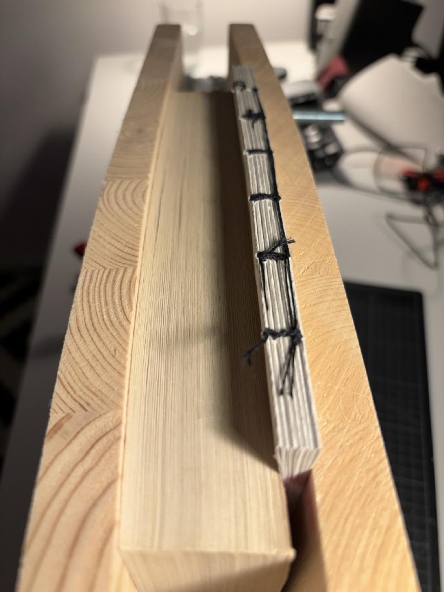

# First Planner Post Mortem

## What worked well

- Duplex printing is easier than expected
- Generating signatures with `pdf2book` is very easy
- The quality of the print is decent even by using CSS and a laser printer

## What didn't work well

### Corners for the cover

I cut the corners **after** applying the glue because I forgot to do it before. So I had to do it fast and the end result is bad.

### Brush bristles

This happened the first time I used the brush. It lost bristles that got glued between the cardboard and the cover. I should have used pliers to remove the bristles.

### Using gray

Gray is a pattern of black and white, it doesn't work well for thin lines. It's better to always use black with different stroke width.

### `pdfbook2` may resize the output

`pdfbook2` requires to specify the margins. The margins seems to resize the original page.

In this example the spacing of the rows was set to 5mm in the CSS, but the actual printed page seems to be slightly less than 5mm

### Wavy binding

Probably too much glue and/or too heavy threading. The paper used in the first planner is 80g/m2 (pretty light). I used double threading. Single threading may work better.

### Missing end pages

Rookie mistake, I didn't add end pages and I got this bad result.

### Cutting signatures

Once the signatures were bound together, I cut them with a cutter, ending up with this bad result. I tried make it look slightly better by using a file, it worked.

### Head band

The head band tears apart. I should heat up the fibers with a lighter before applying it to avoid this.

### Book press bends

The book press slighly bends when I screw in the bolts. I can try to apply less pressure and use the other side of the book press. Plus I clearly overestimated the thinkness of the books I'm going to bookbind.

